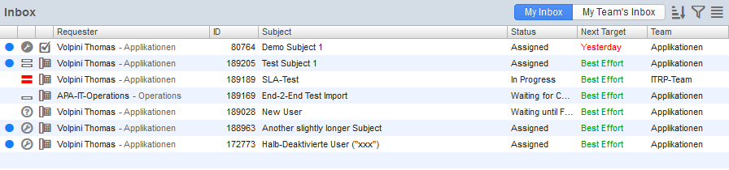
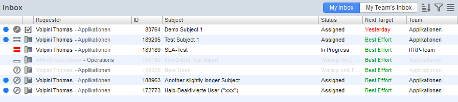
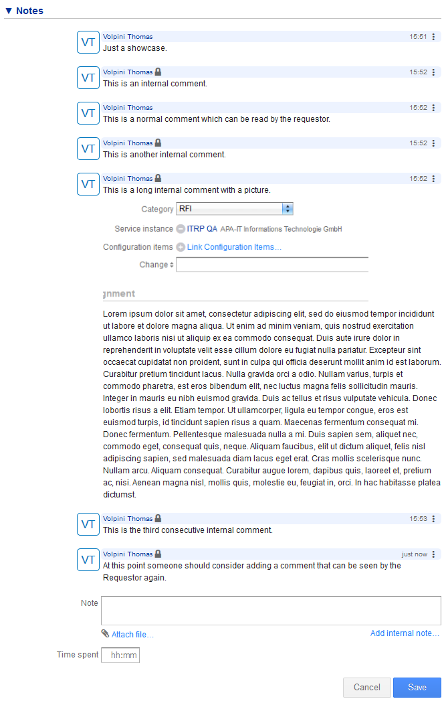
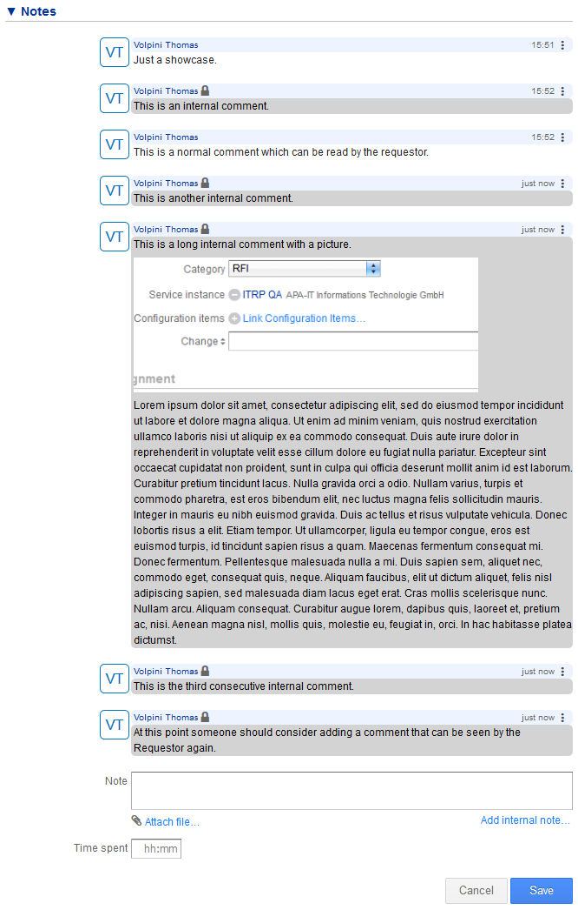

# 4me UI Mods
Tampermonkey script for use with the [4me](https://4me.com) enterprise service management system.

## Overview
We created the script to add useful enhancements to the 4me UI even if they weren't implemented in the official application. This way we can a) demo feature requests to 4me and b) use those modifications ourselves.

Use this script at your own risk. Merge requests and suggetions are always welcome.

## Usage
Install the [Tampermonkey](https://www.tampermonkey.net/) extension for your browser, add a new script and copy-paste.

## Features
### Waiting-For
When your 4me inbox contains many entries it can be difficult to identify those you want to focus on next. Requests that are **Waiting for Customer** or **Waiting for...** a date usually are less urgent. Therefore we change their font color to grey so the other Records stick out better.

|Default Inbox|With mod enabled|
|---|---|
|  |  |

### Internal comments
Internal comments are great for adding information to requests that should not be visible to customers - like technical details.

However, we sometimes have the issue that the analysis of an incident goes on for a few hours, specialists add only internal comments, and the customer cannot see that the Incident is actually being worked on.

The script changes the background of internal comments so it's more visible if it's been some time since the last customer-visible comment.

| Normal and internal comments without the mod | With mod enabled |
|---|---|
|  |  |

### Highlighting Records
Set the `highlightRecords` variable to change the color of record numbers in the inbox and record lists.
